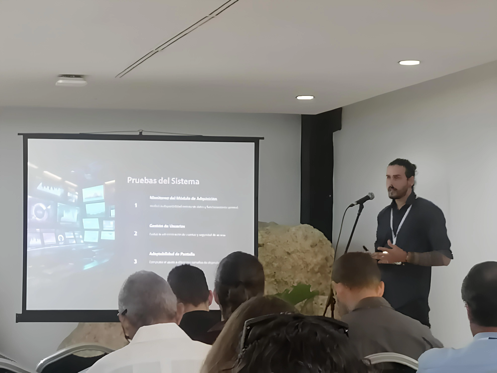

# VibroSoft: Plataforma de Gestión de Dispositivos Remotos

VibroSoft es una aplicación web desarrollada con Django, diseñada para monitorear, gestionar y extraer datos de dispositivos de adquisición remotos (como microcontroladores o sensores) a través de una interfaz web intuitiva y una API REST.

[](https://www.python.org/)
[](https://www.djangoproject.com/)
[](https://www.django-rest-framework.org/)

## 🏛️ Contexto y Reconocimiento

Este proyecto es el resultado de una colaboración académico-industrial, desarrollado para el **Grupo de Análisis y Procesamiento de Señales (GAPS)** de la Universidad Tecnológica de La Habana (CUJAE). Nace como una solución a la necesidad de sistemas de monitoreo y diagnóstico industrial en Cuba, permitiendo la gestión remota de módulos de adquisición de datos desde cualquier parte del mundo mediante comunicación HTTP.

Actualmente, Vibrosoft es utilizado por el grupo GAPS para sus investigaciones en el análisis de señales de vibración.

El proyecto fue presentado y reconocido en la **Convención Científica Internacional de Ingeniería y Arquitectura**, celebrada en el Palacio de las Convenciones de La Habana el 28 de noviembre de 2024, destacando su innovación en el campo de los sistemas de adquisición de datos.

### 📸 Presentación en la Convención

<p align="center">
  
  
</p>

## ✨ Características Principales

*   **Gestión Remota de Dispositivos**: Comprueba el estado (en línea / fuera de línea) de múltiples dispositivos desde un panel central.
*   **Explorador de Archivos**: Navega por los archivos de datos almacenados en cada dispositivo remoto.
*   **Visualización y Descarga de Datos**: Visualiza el contenido de los archivos de texto directamente en el navegador y descárgalos en formato `.txt` o como un archivo `.zip` consolidado.
*   **Configuración Remota**: Actualiza los parámetros de muestreo e intervalo de los dispositivos a través de un formulario web.
*   **API REST para Ingesta de Datos**: Un endpoint simple para que los dispositivos registren marcas de tiempo en el servidor.
*   **Autenticación de Usuarios**: Sistema de login para proteger el acceso a la plataforma.
*   **Panel de Administración Moderno**: Interfaz de administración mejorada y amigable gracias a `Django Jazzmin`.

## 🚀 Tecnologías Utilizadas

*   **Backend**: Django, Django REST Framework, PostgreSQL
*   **Frontend**: Django Templates, HTML5, CSS3, Bootstrap
*   **Base de Datos**: SQLite 3 (desarrollo), PostgreSQL (producción)
*   **Comunicación HTTP**: Biblioteca `requests` para interactuar con los dispositivos.
*   **Admin**: `django-jazzmin` para una experiencia de administración mejorada.

### 🛠️ Tecnologías Utilizadas

*   **Backend:**
    *   
    *   
    *   
*   **Frontend:**
    *   
    *   
    *   
*   **Base de Datos:**
    *    (Desarrollo)
*   **Administración:**
    *   
*   **API Documentation:**
    *   

## ⚙️ Instalación y Puesta en Marcha

Sigue estos pasos para tener una copia local del proyecto funcionando.

**1. Clonar el repositorio**
```bash
git clone https://github.com/tu-usuario/DJ-DRF-vibrosoft.git
cd DJ-DRF-vibrosoft
```

**2. Crear y activar un entorno virtual**
```bash
# Para Linux/macOS
python3 -m venv venv
source venv/bin/activate

# Para Windows
python -m venv venv
venv\Scripts\activate
```

**3. Instalar las dependencias**
```bash
pip install -r requirements.txt
```

**4. Aplicar las migraciones de la base de datos**
```bash
python manage.py migrate
```

**5. Crear un superusuario**
Este usuario te permitirá acceder al panel de administración y a la aplicación web.
```bash
python manage.py createsuperuser
```

**6. Iniciar el servidor de desarrollo**
```bash
python manage.py runserver
```
La aplicación estará disponible en `http://127.0.0.1:8000`.

## 📋 Uso de la Aplicación

1.  **Inicia sesión**: Accede a `http://127.0.0.1:8000/login/` y utiliza las credenciales del superusuario creado.
2.  **Añade un dispositivo**:
    *   Ve al panel de administración: `http://127.0.0.1:8000/admin/`.
    *   En la sección "VIBROTECH", haz clic en "Añadir" junto a "Dispositivos".
    *   Rellena los campos, especialmente el **nombre** y la **URL** base del dispositivo (ej: `http://192.168.1.105`).
    *   Asegúrate de marcar la casilla **"Activo"**.
3.  **Gestiona tus dispositivos**: Vuelve a la página principal (`http://127.0.0.1:8000/`) para ver los dispositivos activos y empezar a interactuar con ellos.

## 📁 Estructura del Proyecto

```
.
├── api/                # App Django para la API REST de ingesta de datos.
├── vibrotech/          # App Django principal que gestiona la lógica web y la interacción con dispositivos.
├── vibrosoft/          # Configuración del proyecto Django.
├── templates/          # Plantillas HTML para la interfaz web.
├── static/             # Archivos estáticos (CSS, JS, Bootstrap).
├── requirements.txt    # Dependencias de Python.
└── manage.py           # Utilidad de línea de comandos de Django.
```

## 🔌 Endpoints de la API

La API está diseñada para ser consumida por los dispositivos remotos.

*   `POST /api/datetime/`: Crea un nuevo registro de fecha y hora en la base de datos.
*   `GET /api/datetime/`: Obtiene todos los registros de tiempo.
*   `GET /api/obtener-fecha-hora/`: Devuelve la fecha y hora actual del servidor en formato JSON.
